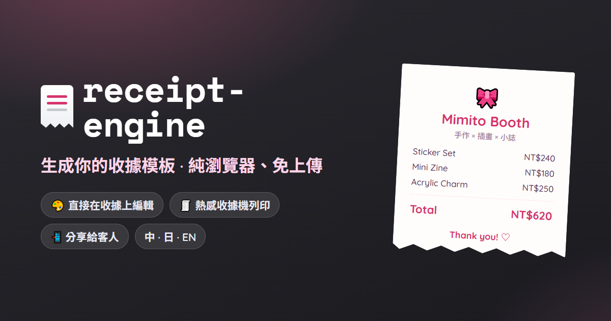
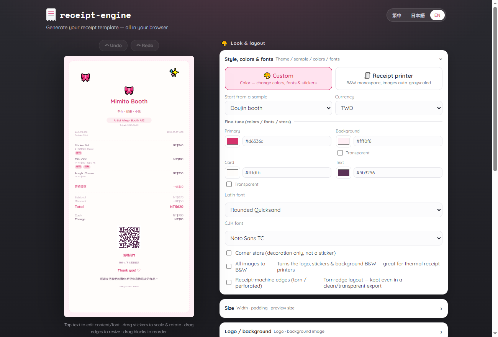
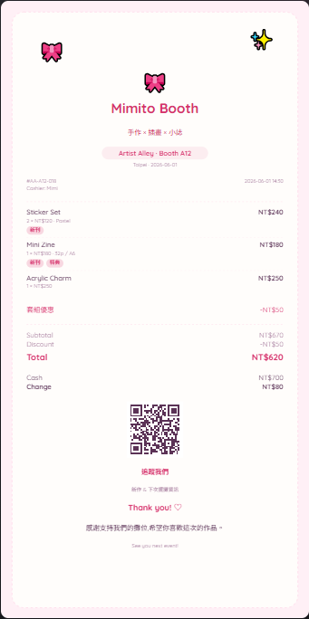
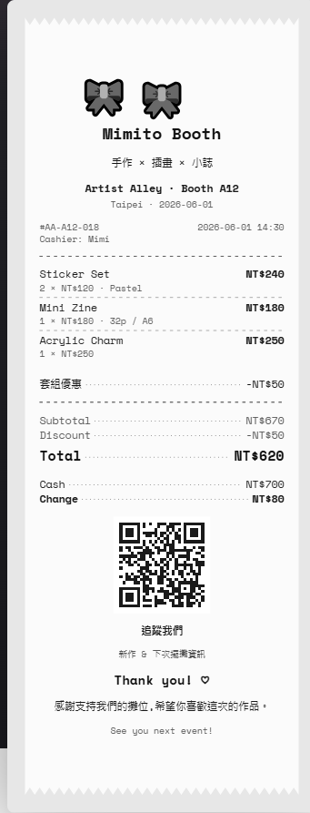

<div align="center">



# 🧾 receipt-engine

**レシートを、もっと楽しく。**
構造化されたレシート JSON を、きれいで・シェアできて・印刷できるレシートに —— ブラウザだけでデザイン。

<br>

[](https://mimito-6.github.io/receipt-engine/)
&nbsp;
[](docs/)

[](https://github.com/mimito-6/receipt-engine/actions/workflows/pages.yml)
[](LICENSE)


[English](README.md) · [繁體中文](README.zh-TW.md) · **日本語**

</div>

---

<p align="center">
  <a href="https://mimito-6.github.io/receipt-engine/">
    
  </a>
</p>

> **レシート JSON を 1 つ入れる → SVG・HTML・PNG が出る。** 同じデータから複数の出力 —— さらにレシート上で直接編集できるエディタ付き。
> 同人ブース、コミケ / 同人即売会、ハンドメイドマルシェ、ポップアップストア、ローカルファーストな POS ツール（例:[OpenBooth](apps/openbooth-bridge)）のために。

レシートはダサくなくていい。ブースに立つ作り手にとって、レシートは**ブランドの接点** —— お客さんが取っておいて、スキャンして、シェアする小さなギフトです。
`receipt-engine` はそれを簡単にしつつ、中立で埋め込み可能なライブラリのまま:レシート JSON を渡せば PNG / SVG / HTML が返り、
あるいはブラウザエディタを店主に渡して、自分でデザインしてもらえます。

## ✨ ハイライト

- 🖌️ **直接操作エディタ** —— 文字をタップして装飾、ステッカーをドラッグで拡大縮小・回転、ふちをドラッグでサイズ調整、ブロックをドラッグで並べ替え。すべてブラウザ内、スマホでも。
- 📄 **1 つのスキーマ、複数の出力** —— SVG（正本）· HTML · PNG、すべて決定論的。
- 🎨 **テーマ** —— `custom`（カラー、色・フォント・ステッカー変更可）と `thermal`（等幅、画像は自動グレースケール）、`mergeTheme` で完全カスタムも。
- 🖨️ **感熱印刷** —— ESC/POS ラスター（GS v 0）を **Web Bluetooth** 経由で、ブラウザから直接印刷。
- 📲 **ブラウザ PNG とシェア** —— フロントの canvas で PNG 化、Web Share でスマホへ —— サーバー不要。
- 🌏 **多言語** —— エディタ UI は 中文 / 日本語 / English を内蔵。
- 🔗 **QR コード**、🔢 **合計の自動計算**、🧱 **カスタムブロック**、🧩 **React コンポーネント** + **CLI** + 型付きコア API。
- 🛡️ **安全・決定論的** —— ユーザー入力はすべてエスケープ。レシートがサーバーに送信されることはありません。

## 🎨 テーマ

| 🎨 `custom` —— カラー・ブランド化 | 🧾 `thermal` —— レシートプリンター風 |
|:---:|:---:|
|  |  |
| 色・フォント・ステッカー・ロゴ・背景画像（拡大縮小/回転）・QR。 | 等幅・白黒・ギザギザの切り取りふち —— 本物のレジが印刷するそのまま。 |

## 🚀 試す

**▶️ [ライブエディタを開く](https://mimito-6.github.io/receipt-engine/)** —— インストール不要・ログイン不要、スマホでも。
サンプルのレシートをその場で編集して、**PNG / SVG / HTML** をダウンロードしたり設定ファイルを保存。

ローカルで動かす場合（pnpm モノレポ。パッケージはまだ npm に未公開）:

```bash
pnpm install
pnpm build
pnpm test
# その後 apps/playground/public/index.html をブラウザで開く
```

<details>
<summary><b>エディタでできること</b></summary>

- **文字をタップ** → コンテキストインスペクタで内容・フォント・色・サイズ・太さを変更（要素ごとに `styleOverrides` へ保存）。ダブルタップでその場編集。
- **ステッカーをタップ** → PS 風の変形フレーム:四隅で拡大縮小、上部で回転、タッチでは 2 本指ピンチ。ドラッグ移動でアラインメントスナップ。
- **カードのふちをドラッグ** → 幅 / 上下の余白を変更。
- **ブロックをドラッグ**（または並べ替えパネルの ↑/↓）→ レイアウト順を変更（`blockOrder`）。
- **ロゴ / 背景**をアップロード（背景は拡大縮小・回転・透過可）、**色とフォント**を選択、**透過**の背景 / カード / QR 下地を切替、
  `custom` / `thermal` を切替、設定ファイルを保存・読込、**フォント埋め込み済みの PNG** をダウンロード（書き出しがプレビューと一致）。

エディタはレシートモデルだけを変更 —— 書き出しは決定論的で、エディタのメタデータは含みません。
</details>

## 📦 パッケージ

| パッケージ | 役割 |
|------------|------|
| `@receipt-engine/core` | スキーマ・検証・正規化・合計計算。 |
| `@receipt-engine/themes` | 組み込みテーマ + `getTheme` / `mergeTheme`。 |
| `@receipt-engine/render-svg` | レシート → SVG 文字列（正本）。 |
| `@receipt-engine/render-html` | レシート → スタンドアロン HTML。 |
| `@receipt-engine/render-png` | レシート → PNG `Buffer`（resvg、サーバー側）。 |
| `@receipt-engine/bitmap` | 感熱プリンター向けの 1-bit ディザ + ビットパッキング。 |
| `@receipt-engine/escpos` | ESC/POS コマンド + ラスター出力（GS v 0）。 |
| `@receipt-engine/connect` | ブラウザ配信:Web Bluetooth 感熱印刷、canvas PNG、Web Share。 |
| `@receipt-engine/import` | POS / 注文 → レシートのアダプタ（OpenBooth 含む）+ テンプレート適用。 |
| `@receipt-engine/react` | `<ReceiptCard />`。 |
| `@receipt-engine/cli` | `receipt-engine render …`。 |

**Apps:** [`apps/playground`](apps/playground) —— 上でデプロイしたブラウザエディタ ·
[`apps/openbooth-bridge`](apps/openbooth-bridge) —— OpenBooth ⇄ receipt-engine 連携バンドル。

## 🧑‍💻 ライブラリとして使う

```ts
import { renderReceiptToSvg } from '@receipt-engine/render-svg'
import { renderReceiptToPng } from '@receipt-engine/render-png'

const svg = renderReceiptToSvg(receipt, { theme: 'custom', width: 720 })
const png = await renderReceiptToPng(receipt, { theme: 'custom', pixelRatio: 2 })
```

```tsx
import { ReceiptCard } from '@receipt-engine/react'

export const App = () => <ReceiptCard receipt={receipt} theme="custom" width={360} />
```

<details>
<summary><b>CLI</b></summary>

```bash
# リポジトリ内では dev スクリプトで実行:
pnpm --filter @receipt-engine/cli dev render examples/cute-booth/receipt.json --theme custom --format svg --out receipt.svg

# ビルド後は bin が使えます:
receipt-engine render receipt.json --theme custom --format png --out receipt.png
```

オプション:`--theme custom|thermal`、`--format svg|html|png`、`--out <path>`、`--width <number>`、`--pretty`。
`--out` を省くと `svg`/`html` は標準出力へ。
</details>

## 📄 レシート JSON

```jsonc
{
  "schemaVersion": "0.1",
  "currency": "JPY",
  "merchant": { "name": "Mimito Booth", "subtitle": "手作 × イラスト × 同人誌", "logo": "./assets/logo.svg" },
  "event": { "name": "コミティア", "boothNumber": "A12" },
  "transaction": { "receiptNo": "AA-A12-018", "issuedAt": "2026-06-01T14:30:00+09:00" },
  "items": [
    { "name": "ステッカーセット", "quantity": 2, "unitPrice": 500, "tags": ["新刊"] },
    { "name": "ミニ冊子", "quantity": 1, "unitPrice": 800, "tags": ["特典"] }
  ],
  "discounts": [{ "label": "セット割", "amount": 200 }],
  "payments": [{ "method": "現金", "amount": 2000 }],
  "qr": { "value": "https://instagram.com/mimito.art", "label": "フォローしてね" },
  "message": { "title": "Thank you! ♡", "body": "ブースへのご来場ありがとうございました！" }
}
```

全フィールドの説明は [`docs/schema.md`](docs/schema.md)。すぐ使えるサンプルは [`examples/`](examples)（`simple`・`cute-booth`・`openbooth-like`）。

## 📱 スマホで使う

レンダリング経路はすべて**フロントエンド JavaScript** —— SVG・HTML・**PNG（canvas、`@receipt-engine/connect` 経由）** は
すべてモバイルブラウザ内で動作し、サーバー不要。playground はこの方法でスマホ上でレンダリング・PNG 書き出し、さらに
**Web Bluetooth で感熱印刷**します。（`@receipt-engine/render-png` はネイティブモジュールを使う別のサーバー側 PNG 経路で、バッチ / Node 用。）

いちばん簡単な使い方:スマホで **[デプロイ済みエディタを開く](https://mimito-6.github.io/receipt-engine/)**。
自分のアプリ（React Native / WebView）に組み込むなら、`@receipt-engine/render-svg` か `@receipt-engine/render-html` を直接 import。

## 📚 ドキュメント

[Schema](docs/schema.md) · [テーマ](docs/themes.md) · [レンダリング](docs/rendering.md) · [ロードマップ](docs/roadmap.md)

## 🗺️ ロードマップ

**リリース済み（v0.1）** ブラウザエディタ · ブラウザ PNG 書き出し · ESC/POS 感熱印刷（Web Bluetooth）· OpenBooth 連携 · 中/日/英の多言語。
**次** ホスト型レシートページ · クーポン QR · コミュニティテーマ · プラグイン。完全版は [`docs/roadmap.md`](docs/roadmap.md)。

## 📜 ライセンス

[MIT](LICENSE) © mimito
