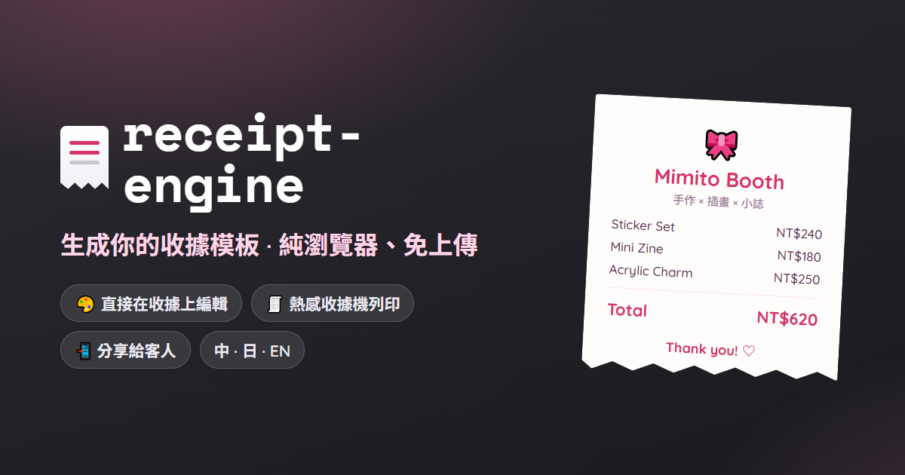
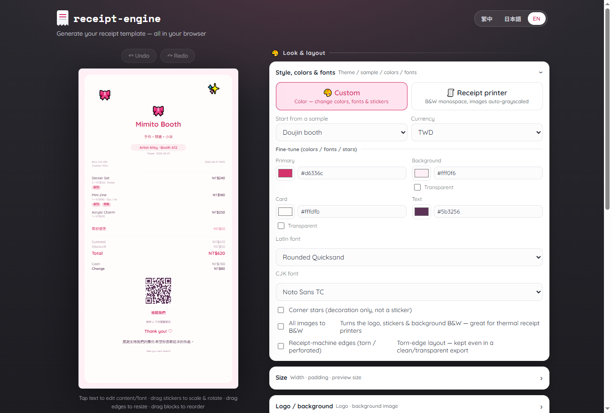
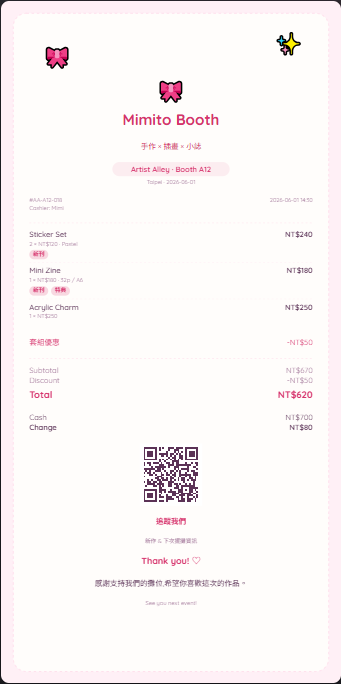
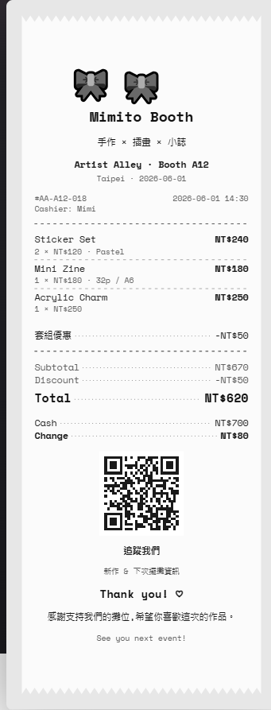

<div align="center">



# 🧾 receipt-engine

**Receipts, but delightful.**
Turn structured receipt JSON into beautiful, shareable, printable receipts — designed right in your browser.

<br>

[](https://mimito-6.github.io/receipt-engine/)
&nbsp;
[](docs/)

[](https://github.com/mimito-6/receipt-engine/actions/workflows/pages.yml)
[](LICENSE)


English · [繁體中文](README.zh-TW.md) · [日本語](README.ja.md)

</div>

---

<p align="center">
  <a href="https://mimito-6.github.io/receipt-engine/">
    
  </a>
</p>

> **One receipt JSON in → SVG, HTML, and PNG out.** Same data, many surfaces — with a delightful
> direct-manipulation editor on top. Built for artist-alley booths, doujin events, craft markets,
> pop-up stores, and local-first POS tools (e.g. [OpenBooth](apps/openbooth-bridge)).

A receipt doesn't have to be ugly. For a creator at a booth, the receipt is a **brand touchpoint** —
a tiny gift the customer keeps, scans, and shares. `receipt-engine` makes that easy while staying a
neutral, embeddable library: pass it a receipt JSON, get back PNG / SVG / HTML — or hand a merchant
the browser editor and let them design their own.

## ✨ Highlights

- 🖌️ **Direct-manipulation editor** — tap text to restyle, drag stickers to scale/rotate, drag the
  card edges to resize, drag blocks to reorder. Runs entirely in the browser, on phones too.
- 📄 **One schema, many outputs** — SVG (canonical) · HTML · PNG, all deterministic.
- 🎨 **Themes** — `custom` (colorful, change colors / fonts / stickers) and `thermal` (monospace,
  auto-grayscaled images), plus fully custom themes via `mergeTheme`.
- 🗂️ **8 ready-made starter templates** — minimal · doujin booth · zine press · café · craft market ·
  pixel arcade · boutique · neon night — each with its own font, palette and personality. Pick one
  and tweak, or start blank.
- 🪙 **Any currency** — pick a code or just type your own symbol (`NT$`, `¥`, …); the editor renders it as-is.
- ✶ **Borderless vector stickers** — a clean, solid-fill mark set (no emoji), scalable / rotatable on the canvas.
- 🖨️ **Thermal printing** — ESC/POS raster (GS v 0) over **Web Bluetooth**, straight from the browser.
- 📲 **Browser PNG & share** — rasterize to PNG client-side (canvas) and share via Web Share — no server.
- 🌏 **i18n** — the editor UI ships in 中文 / 日本語 / English. One gap: in the Bluetooth
  print panel only the *controls* are translated — its runtime status line, error hints and
  diagnostics labels are Traditional Chinese only.
- 🔗 **QR codes**, 🔢 **smart totals**, 🧱 **custom blocks**, 🧩 **React component** + **CLI** + typed core.
- 🛡️ **Safe & deterministic** — every user value is escaped; the receipt never leaves the browser for a server.

## 🎨 Themes

| 🎨 `custom` — colorful & brandable | 🧾 `thermal` — receipt-printer look |
|:---:|:---:|
|  |  |
| Colors, fonts, stickers, logo, background image (scale / rotate), QR. | Monospace, B&W, torn perforated edges — what a real till prints. |

## 🚀 Try it

**▶️ [Open the live editor](https://mimito-6.github.io/receipt-engine/)** — no install, no login, works on your phone.
Edit the sample receipt right on the canvas, then download **PNG / SVG / HTML** or save a config file.

Or run it locally (pnpm monorepo — packages aren't published to npm yet):

```bash
pnpm install
pnpm build
pnpm test
# serve the static editor (any static file server works), then open the printed URL:
npx serve apps/playground/public
```

Serve it rather than opening `apps/playground/public/index.html` from `file://`: font
embedding fetches the bundled faces same-origin, which a `file://` page can't do, and Web
Bluetooth needs a secure context — `localhost` counts, `file://` doesn't.

<details>
<summary><b>What you can do in the editor</b></summary>

- **Start from a template** → 8 ready-made styles (or blank), then make it yours.
- **Tap any text** → a contextual inspector to change its content, font, color, size and weight
  (saved per-element in `styleOverrides`); double-tap to edit text inline.
- **Tap a sticker** → a Photoshop-style frame: corner handles scale, a top handle rotates,
  two-finger pinch on touch; drag to move with alignment snapping.
- **Drag the card edges** → change width / top / bottom padding.
- **Drag a section** (or use the layout-order ↑/↓ panel) → reorder blocks (`blockOrder`).
- Upload a **logo / background** (background is scalable, rotatable, transparent-able), pick
  **colors & fonts**, toggle a **transparent** background / card / QR backing, switch `custom` /
  `thermal`, save/restore a config, and download **PNG with the fonts embedded** so the export
  matches the preview.

The editor only mutates the receipt model — exports stay deterministic and editor-metadata-free.
</details>

## 📦 Packages

| Package | What it does |
|---------|--------------|
| `@receipt-engine/core` | Schema, validation, normalization, totals. |
| `@receipt-engine/themes` | Built-in themes + `getTheme` / `mergeTheme`. |
| `@receipt-engine/render-svg` | Receipt → SVG string (canonical). |
| `@receipt-engine/render-html` | Receipt → standalone HTML. |
| `@receipt-engine/render-png` | Receipt → PNG `Buffer` (resvg, server-side). |
| `@receipt-engine/bitmap` | 1-bit dithering + bit-packing for thermal printers. |
| `@receipt-engine/escpos` | ESC/POS commands + raster output (GS v 0). |
| `@receipt-engine/connect` | Browser delivery: Web Bluetooth thermal print, canvas PNG, Web Share. API below. |
| `@receipt-engine/import` | POS / order → receipt adapters (incl. OpenBooth) + template overlay. |
| `@receipt-engine/react` | `<ReceiptCard />`. |
| `@receipt-engine/cli` | `receipt-engine render …`. |

**Apps:** [`apps/playground`](apps/playground) — the static in-browser editor (deployed above) ·
[`apps/openbooth-bridge`](apps/openbooth-bridge) — the OpenBooth ⇄ receipt-engine integration bundle.

## 🧑‍💻 Use it as a library

```ts
import { renderReceiptToSvg } from '@receipt-engine/render-svg'
import { renderReceiptToPng } from '@receipt-engine/render-png'

const svg = renderReceiptToSvg(receipt, { theme: 'custom', width: 720 })
const png = await renderReceiptToPng(receipt, { theme: 'custom', pixelRatio: 2 })
```

```tsx
import { ReceiptCard } from '@receipt-engine/react'

export const App = () => <ReceiptCard receipt={receipt} theme="custom" width={360} />
```

<details>
<summary><b>CLI</b></summary>

```bash
# from the repo, the CLI runs via the dev script:
pnpm --filter @receipt-engine/cli dev render examples/cute-booth/receipt.json --theme custom --format svg --out receipt.svg

# once built, the bin is available:
receipt-engine render receipt.json --theme custom --format png --out receipt.png
```

Options: `--theme custom|thermal`, `--format svg|html|png`, `--out <path>`, `--width <number>`,
`--pretty`. `svg`/`html` print to stdout when `--out` is omitted.
</details>

<details>
<summary><b>Theme customization</b></summary>

```ts
import { getTheme, mergeTheme } from '@receipt-engine/themes'
import { renderReceiptToSvg } from '@receipt-engine/render-svg'

const theme = mergeTheme(getTheme('custom'), {
  palette: { primary: '#0b7285', accent: '#0b7285' },
})
const svg = renderReceiptToSvg(receipt, { theme })
```
</details>

## 🖨️ Thermal printing

`@receipt-engine/connect` is the browser-side delivery package. Its façade is two pieces —
a function that turns a receipt into something you can show *and* something you can send,
and a printer you can talk to — so a caller never has to know about `GS v 0`,
bytes-per-row, band limits, dithering or GATT characteristics.

```ts
import { renderReceipt, Printer, GPRINTER_BLE_80 } from '@receipt-engine/connect'

// preview + bytes + measurements, in one call
const { preview, escposBytes, metadata } = await renderReceipt(receipt, {
  printer: GPRINTER_BLE_80,   // default; also GENERIC_BLE_58 / GENERIC_BLE_80
  dots: 576,                  // optional override of the profile's paper width
  bitmap: { dither: 'hybrid', inkFloor: 145 },   // optional 1-bpp knobs
  render: { cropToCard: true, hideCardBorder: true },  // optional RenderSvgOptions (minus `paper`)
  job: { feedAfterPrintMm: 20 },                 // optional feed / cut / blank-run elision
})

document.querySelector('#preview')!.innerHTML = preview   // SVG string, safe to inject
console.log(metadata.estimatedLengthMm, metadata.estimatedReceiptsPerRoll)

const printer = new Printer({ profile: GPRINTER_BLE_80, onStateChange: showStatus })
if (Printer.supported) {
  await printer.connect()          // must be called from a user gesture
  await printer.print(escposBytes) // resolves when fully written
  printer.disconnect()
}
```

`renderReceipt()` runs the real production path — native-width SVG → canvas raster →
1-bpp → ESC/POS — so the preview and the bytes can never disagree. It is browser-only
(rasterizing needs a canvas). Its defaults are the `thermal` theme, a transparent page
background (thermal paper is already white; a background would only burn ink), and the
`hybrid` conversion rather than error diffusion, which would stipple glyphs and roughly
triple the bytes sent. `render` overrides the first two and accepts the rest of
`RenderSvgOptions`; `paper` is the one thing it cannot override, since the preview and
the bytes have to describe the same sheet as the printer they were built for.

The `bitmap` knobs are `@receipt-engine/bitmap`'s `ToBitmapOptions`: `dither`
(`'none' | 'floyd-steinberg' | 'atkinson' | 'hybrid' | 'halftone'`), `threshold` — the
global luminance cutoff, default 128, used by the first three — and `inkFloor` /
`paperCeil` (defaults 96 / 250), the solid-ink and bare-paper clamps that `hybrid` and
`halftone` use instead, so type stays solid and paper stays clean while only the
mid-tones get screened. `halftone` additionally takes `spot`
(`round | diamond | line | heart | star`) and `cellSize` (default 8 dots, about 1mm at
203 dpi). `ToBitmapOptions`, `DitherMode`, `SpotShape`, `PrintJobOptions`,
`PaperProfile` and `ReceiptMetadata` are all re-exported from
`@receipt-engine/connect`, so a caller can type these options without reaching for the
underlying packages.

`Printer` is deliberately thin: `connect()`, `print(bytes, opts?)`, `disconnect()`,
`getState()`, `getDiagnostics()` (device name, service/characteristic UUIDs, write mode,
byte counters), plus `Printer.supported` for "does this browser have Web Bluetooth at
all" — Android Chrome yes, iOS Safari no. Writes are queued internally, so concurrent
`print()` calls can't interleave into a garbled receipt, and a failed write rejects
rather than silently reporting success. `raw` exposes the underlying transport for tests
and custom flows.

**Paper profiles** (`@receipt-engine/core`) are the single source of truth for "how wide
is this receipt, in dots" — layout width, raster width and the `GS v 0` header all have
to agree on that number:

| Profile | Paper | Printable | Bytes/row | Side padding | QR box | Max logo |
|---|---|---|---|---|---|---|
| `PAPER_58` | 58mm | 384 dots | 48 | 16 dots | 120 dots | 160 × 76 dots |
| `PAPER_80` | 80mm | 576 dots | 72 | 24 dots | 180 dots | 240 × 114 dots |

Both run at 203 dpi with a 12mm post-print feed and **no outer margin** — on a roll, the
printable width *is* the paper, so a margin is just wasted roll. Look one up by id with
`getPaperProfile('80mm')`. Pass a profile as `renderReceiptToSvg`'s `paper` option and the
receipt is *laid out* at that dot width, so an 80mm receipt is a genuine 576-dot design
rather than a 384-dot one scaled up (which would smear every raster edge).

**Printer profiles** (`@receipt-engine/connect`) say how to talk to a given machine —
GATT service hints, default BLE pacing, cutter capability, post-print feed, and the
largest GATT write it accepts where that has been measured on hardware. Built in:
`GPRINTER_BLE_80` (`'gprinter-ble-80'`, 80mm, no cutter, 180-byte write ceiling),
`GENERIC_BLE_58` and `GENERIC_BLE_80`; `getPrinterProfile(id)` looks them up.

The playground's Bluetooth print panel is built on all of this — image-processing modes,
threshold and artwork-density controls, feed distance, transfer pacing and a true 1-bit
preview are documented in
[`apps/playground/README.md`](apps/playground/README.md#thermal-printing-over-bluetooth-ble).

## 📄 Receipt JSON

```jsonc
{
  "schemaVersion": "0.1",
  "currency": "TWD",
  "merchant": { "name": "Mimito Booth", "subtitle": "手作 × 插畫 × 小誌", "logo": "./assets/logo.svg" },
  "event": { "name": "Artist Alley", "boothNumber": "A12" },
  "transaction": { "receiptNo": "AA-A12-018", "issuedAt": "2026-06-01T14:30:00+08:00" },
  "items": [
    { "name": "Sticker Set", "quantity": 2, "unitPrice": 120, "tags": ["新刊"] },
    { "name": "Mini Zine", "quantity": 1, "unitPrice": 180, "tags": ["特典"] }
  ],
  "discounts": [{ "label": "Set deal", "amount": 50 }],
  "payments": [{ "method": "Cash", "amount": 700 }],
  "qr": { "value": "https://instagram.com/mimito.art", "label": "追蹤我們" },
  "message": { "title": "Thank you!", "body": "感謝支持我們的攤位！" }
}
```

Full field reference in [`docs/schema.md`](docs/schema.md). Ready-made examples live in
[`examples/`](examples) (`simple`, `cute-booth`, `openbooth-like`).

## 📱 Using it on a phone

The rendering paths are **pure front-end JavaScript** — SVG, HTML, and **PNG (canvas, via
`@receipt-engine/connect`)** all run directly in a mobile browser, no server required. That's how the
playground renders, exports PNG, and even **thermal-prints over Web Bluetooth** on a phone.
(`@receipt-engine/render-png` is a separate server-side path using a native module, for batch / Node.)

The simplest way to use it: **[open the deployed editor](https://mimito-6.github.io/receipt-engine/)**
on your phone. To embed rendering in your own app (React Native / WebView), import
`@receipt-engine/render-svg` or `@receipt-engine/render-html` directly.

## 📚 Docs

[Schema](docs/schema.md) · [Themes](docs/themes.md) · [Rendering](docs/rendering.md) · [Roadmap](docs/roadmap.md)

## 🗺️ Roadmap

**Shipped** in-browser editor · browser PNG export · ESC/POS thermal print over Web Bluetooth ·
58mm / 80mm paper presets + printer profiles · test-print & length estimate ·
OpenBooth integration · 中/日/英 i18n.
**Next** resvg-wasm PNG path · more templates · hosted receipt pages · coupon QR ·
community themes · plugin system.
Full list in [`docs/roadmap.md`](docs/roadmap.md).

## 📜 License

[MIT](LICENSE) © mimito
